<h1 align="center">

</h1>

### ✨ [Background]()

**I am an internationally unrecognized, Australian, veteran full-stack engineer with more than 25 years on the keys.  When I first started working online in 1997 we were still trying to figure out what to do with it.  As you can see, I've been largely ignored all over the world for many years.**  

[//]: # ([Check out  my BragDoc for a few highlights]&#40;https://www.bragdocs.com/@ragdata&#41;)

**These days, I'm developing 100% Open Source Software ... and I've started writing to try and pass on a little of what I've learned ...**

### 🔎 [Current Focus]()

Right now I'm concentrating on **building a community** of like-minded super-nerds (much like yourself) who are the first to get their hands on everything I produce, as well as getting access to live support, chat, forums, and a stack of other resources via the [**Discord Server**](https://discord.gg/54PkrM7TKq) that acts as the community hub - **PLEASE JOIN US!**

<h3><a href="https://discord.gg/54PkrM7TKq" target="_blank">Join Me & The RedEyed Community</a></h3>

 

<a href="https://github.com/redeyed-software" target="_blank"><img alt="RedEyed Software" src="https://img.shields.io/badge/RedEyed-Software-555555?style=for-the-badge&labelColor=D20000&logo=data:image/png;base64,iVBORw0KGgoAAAANSUhEUgAAAEAAAABACAYAAACqaXHeAAAACXBIWXMAAADJAAAAyQHGujXfAAAAGXRFWHRTb2Z0d2FyZQB3d3cuaW5rc2NhcGUub3Jnm+48GgAAABJ0RVh0VGl0bGUAUmVkRXllZCBMb2dv1h/FfwAADDNJREFUeJzdm3t0lOWdxz+/d+7JXDIzMUmFKsrNJbh4aSt2m9JSIFKVS7hVrHgo6roeqthu6+5qt7ac7v5h1VI8az1dliNURTkrReq2qKfWUtpqwbUtIKC7Fl0gISGZySTMZGbe97d/5GIuk5l3kkmW7vec95yZ532e3+19Lr/f73keUVXGEv6qqhoxHXUG1KI63UKnCRIGKgB/T7UOIKZom4EcR+SYBYfUae3raGpqGkv5ZCwMEIrWzLbgJlHmATNGQUqBIyq8bIg8E285/UaJROxDyQwQiURCWTx3grUWZHpJiA7FUZCtLkn/4OzZs+2lIDhqAwSDEyrFaW5QWA+ESiGUDcREeIys69F4/IPW0RAasQFERIIVVbeoyMNA5WiEGAXaRPlWe6zpMVU1R0JgRAYIXjBhOllzG8InRsJ0DPBbMa018fiZd4ptaBTbIBSp/iKmeeA8Uh5gtjqMg6FIzepiG9o2gIg4QpHqxxTZzofL1/mEgMJTgWjNJhGxr5edISAy0x0Mt2xXWDkqEccLwq5E0Lda33svVbBqIQOITPX4KxJ7RJhfMgHHAYrs7WiLLlI9lM5XL29XEREjGE5s/3NTHkDQ+kC45VkRceSrl9cAwXDV9xVWlFa0ccUSf6T64XwVhh0CgWjNKlF2jIlY4wxBvxhvbXoq57tcBgiFqqaqwzgABMdauHFCB4bj4+0tJ48OfjFkCIiIoYbxI/7/KA/gxzL/LdfyOKTAH6664zxzckqFawOR6i8NLhwwBILBCZU4zWNAZDwlG0ecFdM1rX8ANbAHOM17GWPlvaoEVQmpMsEymWiZRNQiqFq8X148ojiz9/Qv6OsB0Wg0mFHXCbozNaNGQJUrzAxXZLPMMLNcbJlcZJm4Gd7xyiKcMQzeNRwcdTg57HDyutNFq33P1g7iDu2a1NbWFgNw9pZm1P03oKNSfpqZZW42zZxMmivMLI5+yjaLwRtOF+8aDloMg1Yx6BAhoEpCBBcQtSyq1aLKspibSXNb1zkEOORw8ZrTzc9cbo47nMPyt4mQKd7bgYegXw8IRmreBi4rllqFWtyQ6WJ5OsUMM9tXHheDfU4Xrzk9HHQ6+R8jt0O2pTPO+rIgSZEh78pUudzM8ukeo06zsrztcLLL5WWn20tnjjY28XZ7a+MM6DFAKFozW5XfFENhomWyrivJsnQKb8+X7kL4ucvNLreXXzndZAvQCKvFO7EW1pWH2O32FOR5kWXSkE6xLN2FD2W728uTHh+xEQwRwzI+FoudOugEsOAmu7a80LK4O9XJ4kxXXxdPiMEOXzlbnW5aihCmId2FG2VFOmnLAO8bDr7nLWezt5x6Nbmts5016RRPeHxsc/tIFdEjLNHVwEEDoCd7mxdeVe5NdfJSopWGTAoHSrsYPOQtpy4Qwfvgg7QWOT5XppMA1GfShIrITJnA1Q/cz/JglA1lAa7LdLE30caCTJd95qLzAMTvr64SF43AsOb7VDbNg8kOLrK6025ZhKfcXh7zlhMXwevx8O6xP/KFm2/lV/vtjaSJlsnheEsf0/VlQbZ5fLbaDuZnAEvSKb6S6uR1p5uNvnI7w0Itl37EwC1zGEZ5nyrfTnawpTPep/wvnW4WBsJ8x+cn3tPlFl63gGAwyIrlDbYUAFiVTg1guiJdMHfRh+vq5w/gZwHPu70sCERoFWFPIsZV2UwhMiJZPmUYUJvr7Qwzy+6ONr6QTiJ0z+p/5wtwW3mIE4Nm9F5Bli5ehMfjtqXE8kEK12XTTLDsJXaH43dOhO/4/GwoC7Ax2cGarmR+QhYzDFSHbGIsTnfxbEeMST0C7XO6ud4f5nm3dwiNiooQ8+d9ru/3vM/NLajATDNLrTlwjTDonhQLIRQKsWD+vLz8DjpdLPNXMMUy2ZjsGN7DFJluWOi0/kJ8PdXJQ8l2PCgmwsPecm4rD3HGyE1myaIbB3wFO8Ng5TDdvXdSzIcli26wxS8lwj/6/BxwuPinc4mcHqgI050gfZsa9yc7uKVHiBYxuLcsyOtOV16BVixvgGQSXnkFUiluzGRY7TRInjs3bJvB3b8Xs8wsa7uSxPIsZ3dFw7BzJzgccM01fH5hPcFgkPb23Dtlu90eDjuc3Jfs5Lve8oEOlxKVQLj6LD0B0I2ZLh4+101oTXkFHbNm5f2iDofB+rvuxDAM2LsX1q2DkyeHrV8yOJ3w1a/Cxo3gcvH8j1/gxIn3h63+5ptv8eoLe1iVTvKkx0f6w+m3hUC4uisQrtbe54cen542DN3sLdNAuFqXLr9JT50+rbbQ1qZ6xx2qMHZPba3qwYO2xMlkMvrI9zZrpGqiBsLVWhGu1tnBqPbTNzXEABdWVOlBp0vfNxx6ScUFGghX68RJ03THszvtGUFV9bnnVCsrS6u4YajefbdqKmVLhLePHtO6z87vr2yuJ2XQfTihDwkR/tYXwABWdXWP1Xg8zu13rufWtbfT2tpWuIuuWAGHDsHixSPr4oNxySXw6quwaRN48rvMqsoPnvhX6j4zj7fe+kMhygmHx+e/i0E5gFOGAw/KqnSK7Z4yrJ7yo8eO88yOnUydMpmpUybnJ+33c+LaT7LlF/v4y6ZG7HkHg5QBnq2IcOpfHmfydfUF65848T6rb1nLlq3bME1bPkWTBCLVB1CuHvzGATzVEWOH28uPB63/IsLh3x9g4sQJeal/fHYdx46/w0ctk8c72/l0Nu8mzQA0GgZfLguy1+Upmp9tKL8zRMnZwgQ2lAVZnCPAmFk7o6AwAPULujeUPjAc/NBTZl8w4EWXh70uz4j42YUKxw1Ejg1XodEw2Ob2Mcsc6Fc3LLU3tpf1q9eQse/rAyxJd9HrgYyEny2oHjMsOJyvzqsuN9l+YYuIDGHU2NTE+ru/whu/OzCg/MorZzF58qWUqVJfTKgKRNViTiY9In62YXDEIK2vQZ5MJXC4X5x/9VVXMmnSxX3/d+3ew+y/+gzbfvQ0CxYu4p57v8a5fl7gsqWLuT7TRdkw8b6Vs7SnbTo1In42oaSNXxqJROMZ4IjdVssauhmcaW7m5jVfGrA0WpbF1ie3c23dXPb/+rdAt6s8nOv7ksvD5aFKvunz9/fO+rAok2LljZ8vmp9N/CGRON1sAKjwsp0WhmGwdMkidu3ewzWfnMOen/xHznrvvfcnrl/UwH3/8A0uDgWZN2gOiYtwT1mQ5f4KPjAcPOotZ04wwu8dA+OOgCorA+XF8bv4Impn/IUNbeRl6E2KVn7kE2rp64WaTJs6hcsum84Le160waAbXw8HeeC/P1xoXnZ5+HJZkFM5oksXsD7Vyf3Jzr7o7TeTLqU+3mmb32XTpzFlymR+8uJP89Yz1bqqs+3Mf446LV4Iuzva+GwmTbsI3/AF2Goj7TXTzPJ4Z5xZZpakCJeGLhhNCjwXjrS3NtbCgK0x2VpKDgCValGXSfOKy801wagt5QEOOZzMDUb5ps+PU5WFRa4gBSG69cOfA7fG/gSES8VnVTpFmaptxXPhcjPLDekU/+wr2cG0Vo/DnNTc3JyAQbvDoWjNRlUeKBUnB90e5flCB0BEvhU/e/rB3v8DZ6Ks61HgbIl4lUzoUtEBmsV0b+pfMMAA8fgHrQh/Xzp+5xlU7ovFTgyI54ecERIRIxCu3g/MHk/ZxgH7E21NdTpI4SGLsapaYlq3ACU5j3+eIIHDsW6w8jDMOcF4/My7KnL72Ms1PhC4s735ZM6od9g9g8TZ08+p8P2xE2ucoPJIvLXx6eFe5z0r3H1UtvpphVVjItwYQ2BHe1vTzao6bNCZdwtVVa32tso1iuwtvXhjDflZe1vlrfmUBxv3BVQPpTvaoouEP6Njsyr/ngh5lxY6KQ5FXJkREcMfqX5ElHsK1/4/hMojiVjj1wp9+V4UfWcoEK5uEJEtlOg4XQmRULgj0dpYVE8d0aWpnsPUTwLXFt14bLDfsPTWWKzpv4ptWIprc98FLhgRkdGjVZRvt8eaNtvt8oMx6ouTodBHIzizG1R1PSUMpQugVUQ2i+neNNi3LxYluzrbnU9w/zXoWsBOUm4kOILoVo9hPdEbz48WY3J5uqLiwo9ZojchOh+YSZ4TaAWgwB9BXjIs45lY7OSbpZOyG2NigP4IBGqqcGsdFrWITBdhGkqEHNfnEVpVOY7qUeAwWWNfInG6eSzl+1/8tgjf0sKlAQAAAABJRU5ErkJggg==" /></a>

[//]: # ()

### ❤️ [Supporters]()

<table>
<tr>
<td width="94"></td>
<td>
<h3><a href="https://jetbrains.com" target="_blank">Many Thanks to JetBrains for Their Invaluable Support</a></h3>

**JetBrains very generously provide me with a free license for their products every month, and you can get one too if you're working on a public, open-source project!**  I've used JetBrains' IDEs for many years now, and was more than happy to pay for a license every year back when I was working in the corporate sector.  **Absolutely my first choice in IDEs!**
</td>
</tr>
</table>

<h3><a href="https://github.com/sponsors/Ragdata" target="_blank">Click here to find out about available sponsorship opportunities!</a></h3>

<h4>If sponsorship isn't right for you, but you have found my work to be useful in some way, would you please consider buying me a coffee to help keep me going?</h4>

[//]: # ()
[//]: # ()
[//]: # ([![Stand With Ukraine]&#40;https://raw.githubusercontent.com/vshymanskyy/StandWithUkraine/main/badges/StandWithUkraine.svg&#41;]&#40;https://github.com/vshymanskyy/StandWithUkraine&#41;)
[//]: # ([![Stand With Ukraine]&#40;https://raw.githubusercontent.com/Ragdata/Ragdata/master/.github/media/Ukraine-FTB.png&#41;]&#40;https://github.com/vshymanskyy/StandWithUkraine&#41;)
[//]: # (![Custom Badge - Ragdata]&#40;https://img.shields.io/endpoint?url=https%3A%2F%2Fbadge-o1fczmhczwsv.runkit.sh%3Flabel%3DBy%26message%3DRagdata%26color%3Dd20000%26style%3Dfor-the-badge&#41;)
[//]: # (![Custom Badge - RedEyed]&#40;https://img.shields.io/endpoint?url=https%3A%2F%2Fbadge-o1fczmhczwsv.runkit.sh%3Flabel%3DRedEyed%26message%3DSoftware%26logoSvg%3Dredeyed%26color%3Dd20000%26style%3Dfor-the-badge&#41;)
[//]: # (![Custom Badge - Ragdata 2]&#40;https://img.shields.io/badge/-Ragdata-555555?style=for-the-badge&logo=data:image/png;base64,iVBORw0KGgoAAAANSUhEUgAAABsAAAAgEAYAAACz+d94AAAABHNCSVQICAgIfAhkiAAAAAlwSFlzAAAAZAAAAGQBeJH1SwAAABl0RVh0U29mdHdhcmUAd3d3Lmlua3NjYXBlLm9yZ5vuPBoAAAnKSURBVFiFtVlrbFTVE/+du7t3a7t3u7vdPhb6pyjFankUiSYWm1gTCsHEWBOpEhEViG9RawXCB1GpNUKaKAFqNFowFkVQxMgj4W2hjRRMlwYQpAil72633W633e7ee8//w3BY+oK2sfPl9JwzZ2Z+M3PmzN6Cc845B8ZrrKkBgOzss2cBoLq6uhoA5s8fb70SxonOnmWMseXLOQeAw4dpNSNDkgBg3z6xP176xw1YIAAAZWUEbNMmsU7zsjKjEQB+/HG89DMRutGS280YYxMnMgYAn35KY1SUpgHAyy/PmsU5552dgv/8ecYYS09PT+ec8/PnxfrFi4wxpiihEABs2UK22Gy6DgBvvUVyrl4dN2CVlYwxdtddFgsAvP8+ra5aRWN0dH/uc+dkGQAyMx96SFEmTnS5GJNlVX3jDc5DIaNx8+aqKr+/oaGpiQBVVtK5adP6y+npofGzz7q7AWDDhsxMzjnv7R0zMPKwLFMEXnqJVtesoXHSpKHF/fbbmTMmk8m0du2KFRaLw7FwIcAY8MordK0bGgCAsUmTaL209KOP/H6/f/v2nJxwuKfngw/IlieeGFp+XR2NRUUGAwCUllIGkHuGBEZALBZVBYAlS2h75UpKsZSUoRWdPUu+W7ly7lyHw+VKSWFM13W9oIBzxoCpU2/l5pxqI2MzZ940gHHO2KVLnEsSY8XFhw97vU1NdXVRUQCwfj1xzZgxUDM54No1mq1fT3f2u+8IaHc3o3L8+efE+OKLxBgbOzQQt5uAr1v36KM2W3y8onDOmCTl55MDBhsgKDMzHA4Gr1yprDSZoqLuuWc4PqILFwh0aen+/R0dzc11dVYrEMmYiGP6k89HOLZtY+TDri7aUBQadZ0Y9u07dUqWZXn79oICRbHb775b13UdeO454ktPv72BgM3Gua4DO3f6fB6Ppj37rNXqdBoM7e2SJI24Jp8/T9xlZevX+/1dXVevPvxwKNTbu2gROfTxx4lPSPT7bwATufu//xFjQcEjj8TFJSefOEEZfOAAwDljNttITRG0dGlvb3c3sGxZMBgIAN9+SwXom2+iomJiRisNoOTt7GQMMJkWLDhxwuttaJgzh/aKi2m8fv0GwkhZpkiZTJzruqbJ8lgB0UkgNzcUurWGPfVUMNjTA5jNY3tmhD2ccx4OGwwUCLO5P09Hxw1g9fWRYwBgtRqNgKb5fGNRDQDz5vX1BYNAXBwlryC7nVIzJycUCgbHKh0wmRiTpM5Oki2ukKD6eomAUAcHiCyNj1dVVTUaGxtplUrGSGjiRF3XNGDJEkq94eiFF2hf8I+OVFVVVbWnp6mJ5gkJYociWF1tJCBud/+0uO++rq6uroYGjyc21uFISmpoWLQoGAwEUlKmTtU0VQUSEigSTicZFh9PkYikGGOMAYqyYMGCBUAodPny5ctAVFRGRkYGAOzatWsX8NNPPp/HA/T1EX9bG2OSBHg8kmQwAK2tVDb++cdgMBqBH34wm2Ni6ut9Pp/P5/N6a2oYY+z++4XlIlA3IlZV1X8j0gGQmbW1R4/KclQUkJ6uquEwMGuWqoZCQHIyARt4ZxITCwsLC4FJk3bs2LEDsNuXLVu2DEhOLi0tLQVkecqUKVMi/OK8kCfkz5hB+srLTSZ62wCgtrZ/BAcCO31amjGDc86vXKHlc+dotNsvXGCMsZQUqkK1tU1N5MHXXlMUhwO4dMlgMJmGTxa/f8+ePXsAVW1vb28HmptXr169GgiH6+vr6wGrNTc3N3f481euUISEvuvXDQaDgUoH57W11dWMMTZ5srCXxpqamTM55/zffwe8JLt3i7/CYQDIyaEEO3NGrHu9lBqvv64odjtw6pTJRH1hfzIaXS6XC5Aks9lsBhIS1q5duxaQJIvFYgG6uw8ePHhw8Lm//jIaZRl49VUC1NY28L3TdcaqqqilmjdPrFKkfvlFzG8eIcaffxZzuoTz5xsMZjNw6NCtcAGgt5fuxKpVFovNBly7Rh6OKNI0TQM4D4fDYcDjKS4uLgZ0PRAIBABZnjx58mSAMYpEXR2df+89RbHZgECA5PcnVWVMlnX92DECMn/+TSDSMMCox6qupgMnT9JqTs7hw62tra1NTYxxzjk1YLdSKEROaGkhz5rNaWlpaYDNlpeXlwdIUkxMTAwgy6mpqalAR8e2bdu2ARMmbNy4cSNgMDgcDkfkvJA3kBjjHHC7jxxpa2tra2wknrlzabe8fPp0zkUvCgDGwQIAYMMGmv36K92jp58mr+zdS9GYPbs/P5CWpqqqCkhSdHR0NNDaWlRUVAQ0N69Zs2ZN5G4Fg2632w309FRUVFQAqtrW1tYGpKVRNRTyBj7eui5JjP3+O6X9M8/QqtVKfMLeW3AM/tnCGGOSRLE5d44UeTxz5jidEyYsXw5omqa53cRrNot3SJTtgSQeZyo+fX0ul65rmtk8XJ+Ylxcb63QCDQ1UrIhCIc4ZY+yBByoqvN7m5q+/pnW7ndru6dOpfkdagSHE38qQn0+gs7JOnPB4GhttNsYAzo8dE9yi/A8kUQSWLrVa4+LI4Li4ixcXL6b5n38OXXQGyiN9R46cPOn1NjdTjw/MmUN25ecPBHQbYET0DOzfL6oNRa6wUJI4B778Ujhh2jQypLWVPLxuXUxMbCywYgVVTfGwChJFJj/fYrHbgZUrqfg0NtJ5Ie+mgRLnjJWUkP5PPqHVnTuprB84MJz9g+7YIOQSALzzDgGsqTl+vLOztdXvz8qy2RITjx+vqjKZZDk7u6SEunbRQYyUTp40mcxm4PRpq1WWgQcfpIeZ6OjR8vLOzpaWYJD0z55NsZk+/Y5234mBqs316yT4+efJ6E2bqJktKSHDdH20gAaSOE/yNC02VtfD4c2bSe/GjSR78eKMjMgnhtvRqL9SUW/28cc0i4nJyrLbExNdLpKxaNHtzg71aWBo+v77ioqOjpaW9naS6/XS1RB670yj/q5IVejDD2mWlFRYGAj4fHv30jVvbh6tvAjRa7huXXe3z3fwIAGKiyN9hYWjlTaGD6ZUhf7+GwCWLMnODoWCwczM9HRV7evbsoV4Blep25Om3XuvpoVCX3zx2GPhcDCYmdneDtDXsaGr3p1ozF+CFy7knHNNI4Bvv/3VV11dnZ2aFh3Nua5v3TpSOcRfWrp1q8/X0QFcvAgAb76Znc055yP/HTiI/ut/Bhw6BBiNc+c6HHZ7QkJ5uaLY7YmJnCuK3Z6Q4HaLOe0fP/7HHwDw5JP/tR3j9t+Od981m63W1FSr1WZLSiKACQlut9VqtycmVlYuXaooipKWNl76xw2YGJ1Op9PpdLkUJS7O5dq9Oz4+Pj4+PilpvPX+H9FzAjWyi5ldAAAAAElFTkSuQmCC&#41;)
[//]: # (![Custom Badge - Redeyed 2]&#40;https://img.shields.io/badge/-RedEyed_Software-d20000?style=for-the-badge&logo=data:image/png;base64,iVBORw0KGgoAAAANSUhEUgAAAEAAAABACAYAAACqaXHeAAAACXBIWXMAAADJAAAAyQHGujXfAAAAGXRFWHRTb2Z0d2FyZQB3d3cuaW5rc2NhcGUub3Jnm+48GgAAABJ0RVh0VGl0bGUAUmVkRXllZCBMb2dv1h/FfwAADDNJREFUeJzdm3t0lOWdxz+/d+7JXDIzMUmFKsrNJbh4aSt2m9JSIFKVS7hVrHgo6roeqthu6+5qt7ac7v5h1VI8az1dliNURTkrReq2qKfWUtpqwbUtIKC7Fl0gISGZySTMZGbe97d/5GIuk5l3kkmW7vec95yZ532e3+19Lr/f73keUVXGEv6qqhoxHXUG1KI63UKnCRIGKgB/T7UOIKZom4EcR+SYBYfUae3raGpqGkv5ZCwMEIrWzLbgJlHmATNGQUqBIyq8bIg8E285/UaJROxDyQwQiURCWTx3grUWZHpJiA7FUZCtLkn/4OzZs+2lIDhqAwSDEyrFaW5QWA+ESiGUDcREeIys69F4/IPW0RAasQFERIIVVbeoyMNA5WiEGAXaRPlWe6zpMVU1R0JgRAYIXjBhOllzG8InRsJ0DPBbMa018fiZd4ptaBTbIBSp/iKmeeA8Uh5gtjqMg6FIzepiG9o2gIg4QpHqxxTZzofL1/mEgMJTgWjNJhGxr5edISAy0x0Mt2xXWDkqEccLwq5E0Lda33svVbBqIQOITPX4KxJ7RJhfMgHHAYrs7WiLLlI9lM5XL29XEREjGE5s/3NTHkDQ+kC45VkRceSrl9cAwXDV9xVWlFa0ccUSf6T64XwVhh0CgWjNKlF2jIlY4wxBvxhvbXoq57tcBgiFqqaqwzgABMdauHFCB4bj4+0tJ48OfjFkCIiIoYbxI/7/KA/gxzL/LdfyOKTAH6664zxzckqFawOR6i8NLhwwBILBCZU4zWNAZDwlG0ecFdM1rX8ANbAHOM17GWPlvaoEVQmpMsEymWiZRNQiqFq8X148ojiz9/Qv6OsB0Wg0mFHXCbozNaNGQJUrzAxXZLPMMLNcbJlcZJm4Gd7xyiKcMQzeNRwcdTg57HDyutNFq33P1g7iDu2a1NbWFgNw9pZm1P03oKNSfpqZZW42zZxMmivMLI5+yjaLwRtOF+8aDloMg1Yx6BAhoEpCBBcQtSyq1aLKspibSXNb1zkEOORw8ZrTzc9cbo47nMPyt4mQKd7bgYegXw8IRmreBi4rllqFWtyQ6WJ5OsUMM9tXHheDfU4Xrzk9HHQ6+R8jt0O2pTPO+rIgSZEh78pUudzM8ukeo06zsrztcLLL5WWn20tnjjY28XZ7a+MM6DFAKFozW5XfFENhomWyrivJsnQKb8+X7kL4ucvNLreXXzndZAvQCKvFO7EW1pWH2O32FOR5kWXSkE6xLN2FD2W728uTHh+xEQwRwzI+FoudOugEsOAmu7a80LK4O9XJ4kxXXxdPiMEOXzlbnW5aihCmId2FG2VFOmnLAO8bDr7nLWezt5x6Nbmts5016RRPeHxsc/tIFdEjLNHVwEEDoCd7mxdeVe5NdfJSopWGTAoHSrsYPOQtpy4Qwfvgg7QWOT5XppMA1GfShIrITJnA1Q/cz/JglA1lAa7LdLE30caCTJd95qLzAMTvr64SF43AsOb7VDbNg8kOLrK6025ZhKfcXh7zlhMXwevx8O6xP/KFm2/lV/vtjaSJlsnheEsf0/VlQbZ5fLbaDuZnAEvSKb6S6uR1p5uNvnI7w0Itl37EwC1zGEZ5nyrfTnawpTPep/wvnW4WBsJ8x+cn3tPlFl63gGAwyIrlDbYUAFiVTg1guiJdMHfRh+vq5w/gZwHPu70sCERoFWFPIsZV2UwhMiJZPmUYUJvr7Qwzy+6ONr6QTiJ0z+p/5wtwW3mIE4Nm9F5Bli5ehMfjtqXE8kEK12XTTLDsJXaH43dOhO/4/GwoC7Ax2cGarmR+QhYzDFSHbGIsTnfxbEeMST0C7XO6ud4f5nm3dwiNiooQ8+d9ru/3vM/NLajATDNLrTlwjTDonhQLIRQKsWD+vLz8DjpdLPNXMMUy2ZjsGN7DFJluWOi0/kJ8PdXJQ8l2PCgmwsPecm4rD3HGyE1myaIbB3wFO8Ng5TDdvXdSzIcli26wxS8lwj/6/BxwuPinc4mcHqgI050gfZsa9yc7uKVHiBYxuLcsyOtOV16BVixvgGQSXnkFUiluzGRY7TRInjs3bJvB3b8Xs8wsa7uSxPIsZ3dFw7BzJzgccM01fH5hPcFgkPb23Dtlu90eDjuc3Jfs5Lve8oEOlxKVQLj6LD0B0I2ZLh4+101oTXkFHbNm5f2iDofB+rvuxDAM2LsX1q2DkyeHrV8yOJ3w1a/Cxo3gcvH8j1/gxIn3h63+5ptv8eoLe1iVTvKkx0f6w+m3hUC4uisQrtbe54cen542DN3sLdNAuFqXLr9JT50+rbbQ1qZ6xx2qMHZPba3qwYO2xMlkMvrI9zZrpGqiBsLVWhGu1tnBqPbTNzXEABdWVOlBp0vfNxx6ScUFGghX68RJ03THszvtGUFV9bnnVCsrS6u4YajefbdqKmVLhLePHtO6z87vr2yuJ2XQfTihDwkR/tYXwABWdXWP1Xg8zu13rufWtbfT2tpWuIuuWAGHDsHixSPr4oNxySXw6quwaRN48rvMqsoPnvhX6j4zj7fe+kMhygmHx+e/i0E5gFOGAw/KqnSK7Z4yrJ7yo8eO88yOnUydMpmpUybnJ+33c+LaT7LlF/v4y6ZG7HkHg5QBnq2IcOpfHmfydfUF65848T6rb1nLlq3bME1bPkWTBCLVB1CuHvzGATzVEWOH28uPB63/IsLh3x9g4sQJeal/fHYdx46/w0ctk8c72/l0Nu8mzQA0GgZfLguy1+Upmp9tKL8zRMnZwgQ2lAVZnCPAmFk7o6AwAPULujeUPjAc/NBTZl8w4EWXh70uz4j42YUKxw1Ejg1XodEw2Ob2Mcsc6Fc3LLU3tpf1q9eQse/rAyxJd9HrgYyEny2oHjMsOJyvzqsuN9l+YYuIDGHU2NTE+ru/whu/OzCg/MorZzF58qWUqVJfTKgKRNViTiY9In62YXDEIK2vQZ5MJXC4X5x/9VVXMmnSxX3/d+3ew+y/+gzbfvQ0CxYu4p57v8a5fl7gsqWLuT7TRdkw8b6Vs7SnbTo1In42oaSNXxqJROMZ4IjdVssauhmcaW7m5jVfGrA0WpbF1ie3c23dXPb/+rdAt6s8nOv7ksvD5aFKvunz9/fO+rAok2LljZ8vmp9N/CGRON1sAKjwsp0WhmGwdMkidu3ewzWfnMOen/xHznrvvfcnrl/UwH3/8A0uDgWZN2gOiYtwT1mQ5f4KPjAcPOotZ04wwu8dA+OOgCorA+XF8bv4Impn/IUNbeRl6E2KVn7kE2rp64WaTJs6hcsum84Le160waAbXw8HeeC/P1xoXnZ5+HJZkFM5oksXsD7Vyf3Jzr7o7TeTLqU+3mmb32XTpzFlymR+8uJP89Yz1bqqs+3Mf446LV4Iuzva+GwmTbsI3/AF2Goj7TXTzPJ4Z5xZZpakCJeGLhhNCjwXjrS3NtbCgK0x2VpKDgCValGXSfOKy801wagt5QEOOZzMDUb5ps+PU5WFRa4gBSG69cOfA7fG/gSES8VnVTpFmaptxXPhcjPLDekU/+wr2cG0Vo/DnNTc3JyAQbvDoWjNRlUeKBUnB90e5flCB0BEvhU/e/rB3v8DZ6Ks61HgbIl4lUzoUtEBmsV0b+pfMMAA8fgHrQh/Xzp+5xlU7ovFTgyI54ecERIRIxCu3g/MHk/ZxgH7E21NdTpI4SGLsapaYlq3ACU5j3+eIIHDsW6w8jDMOcF4/My7KnL72Ms1PhC4s735ZM6od9g9g8TZ08+p8P2xE2ucoPJIvLXx6eFe5z0r3H1UtvpphVVjItwYQ2BHe1vTzao6bNCZdwtVVa32tso1iuwtvXhjDflZe1vlrfmUBxv3BVQPpTvaoouEP6Njsyr/ngh5lxY6KQ5FXJkREcMfqX5ElHsK1/4/hMojiVjj1wp9+V4UfWcoEK5uEJEtlOg4XQmRULgj0dpYVE8d0aWpnsPUTwLXFt14bLDfsPTWWKzpv4ptWIprc98FLhgRkdGjVZRvt8eaNtvt8oMx6ouTodBHIzizG1R1PSUMpQugVUQ2i+neNNi3LxYluzrbnU9w/zXoWsBOUm4kOILoVo9hPdEbz48WY3J5uqLiwo9ZojchOh+YSZ4TaAWgwB9BXjIs45lY7OSbpZOyG2NigP4IBGqqcGsdFrWITBdhGkqEHNfnEVpVOY7qUeAwWWNfInG6eSzl+1/8tgjf0sKlAQAAAABJRU5ErkJggg==&#41;)
[//]: # (![Custom Badge - Redeyed 3]&#40;https://img.shields.io/badge/RedEyed-Software-d20000?style=for-the-badge&logo=data:image/png;base64,iVBORw0KGgoAAAANSUhEUgAAAEAAAABACAYAAACqaXHeAAAACXBIWXMAAADJAAAAyQHGujXfAAAAGXRFWHRTb2Z0d2FyZQB3d3cuaW5rc2NhcGUub3Jnm+48GgAAABJ0RVh0VGl0bGUAUmVkRXllZCBMb2dv1h/FfwAADDNJREFUeJzdm3t0lOWdxz+/d+7JXDIzMUmFKsrNJbh4aSt2m9JSIFKVS7hVrHgo6roeqthu6+5qt7ac7v5h1VI8az1dliNURTkrReq2qKfWUtpqwbUtIKC7Fl0gISGZySTMZGbe97d/5GIuk5l3kkmW7vec95yZ532e3+19Lr/f73keUVXGEv6qqhoxHXUG1KI63UKnCRIGKgB/T7UOIKZom4EcR+SYBYfUae3raGpqGkv5ZCwMEIrWzLbgJlHmATNGQUqBIyq8bIg8E285/UaJROxDyQwQiURCWTx3grUWZHpJiA7FUZCtLkn/4OzZs+2lIDhqAwSDEyrFaW5QWA+ESiGUDcREeIys69F4/IPW0RAasQFERIIVVbeoyMNA5WiEGAXaRPlWe6zpMVU1R0JgRAYIXjBhOllzG8InRsJ0DPBbMa018fiZd4ptaBTbIBSp/iKmeeA8Uh5gtjqMg6FIzepiG9o2gIg4QpHqxxTZzofL1/mEgMJTgWjNJhGxr5edISAy0x0Mt2xXWDkqEccLwq5E0Lda33svVbBqIQOITPX4KxJ7RJhfMgHHAYrs7WiLLlI9lM5XL29XEREjGE5s/3NTHkDQ+kC45VkRceSrl9cAwXDV9xVWlFa0ccUSf6T64XwVhh0CgWjNKlF2jIlY4wxBvxhvbXoq57tcBgiFqqaqwzgABMdauHFCB4bj4+0tJ48OfjFkCIiIoYbxI/7/KA/gxzL/LdfyOKTAH6664zxzckqFawOR6i8NLhwwBILBCZU4zWNAZDwlG0ecFdM1rX8ANbAHOM17GWPlvaoEVQmpMsEymWiZRNQiqFq8X148ojiz9/Qv6OsB0Wg0mFHXCbozNaNGQJUrzAxXZLPMMLNcbJlcZJm4Gd7xyiKcMQzeNRwcdTg57HDyutNFq33P1g7iDu2a1NbWFgNw9pZm1P03oKNSfpqZZW42zZxMmivMLI5+yjaLwRtOF+8aDloMg1Yx6BAhoEpCBBcQtSyq1aLKspibSXNb1zkEOORw8ZrTzc9cbo47nMPyt4mQKd7bgYegXw8IRmreBi4rllqFWtyQ6WJ5OsUMM9tXHheDfU4Xrzk9HHQ6+R8jt0O2pTPO+rIgSZEh78pUudzM8ukeo06zsrztcLLL5WWn20tnjjY28XZ7a+MM6DFAKFozW5XfFENhomWyrivJsnQKb8+X7kL4ucvNLreXXzndZAvQCKvFO7EW1pWH2O32FOR5kWXSkE6xLN2FD2W728uTHh+xEQwRwzI+FoudOugEsOAmu7a80LK4O9XJ4kxXXxdPiMEOXzlbnW5aihCmId2FG2VFOmnLAO8bDr7nLWezt5x6Nbmts5016RRPeHxsc/tIFdEjLNHVwEEDoCd7mxdeVe5NdfJSopWGTAoHSrsYPOQtpy4Qwfvgg7QWOT5XppMA1GfShIrITJnA1Q/cz/JglA1lAa7LdLE30caCTJd95qLzAMTvr64SF43AsOb7VDbNg8kOLrK6025ZhKfcXh7zlhMXwevx8O6xP/KFm2/lV/vtjaSJlsnheEsf0/VlQbZ5fLbaDuZnAEvSKb6S6uR1p5uNvnI7w0Itl37EwC1zGEZ5nyrfTnawpTPep/wvnW4WBsJ8x+cn3tPlFl63gGAwyIrlDbYUAFiVTg1guiJdMHfRh+vq5w/gZwHPu70sCERoFWFPIsZV2UwhMiJZPmUYUJvr7Qwzy+6ONr6QTiJ0z+p/5wtwW3mIE4Nm9F5Bli5ehMfjtqXE8kEK12XTTLDsJXaH43dOhO/4/GwoC7Ax2cGarmR+QhYzDFSHbGIsTnfxbEeMST0C7XO6ud4f5nm3dwiNiooQ8+d9ru/3vM/NLajATDNLrTlwjTDonhQLIRQKsWD+vLz8DjpdLPNXMMUy2ZjsGN7DFJluWOi0/kJ8PdXJQ8l2PCgmwsPecm4rD3HGyE1myaIbB3wFO8Ng5TDdvXdSzIcli26wxS8lwj/6/BxwuPinc4mcHqgI050gfZsa9yc7uKVHiBYxuLcsyOtOV16BVixvgGQSXnkFUiluzGRY7TRInjs3bJvB3b8Xs8wsa7uSxPIsZ3dFw7BzJzgccM01fH5hPcFgkPb23Dtlu90eDjuc3Jfs5Lve8oEOlxKVQLj6LD0B0I2ZLh4+101oTXkFHbNm5f2iDofB+rvuxDAM2LsX1q2DkyeHrV8yOJ3w1a/Cxo3gcvH8j1/gxIn3h63+5ptv8eoLe1iVTvKkx0f6w+m3hUC4uisQrtbe54cen542DN3sLdNAuFqXLr9JT50+rbbQ1qZ6xx2qMHZPba3qwYO2xMlkMvrI9zZrpGqiBsLVWhGu1tnBqPbTNzXEABdWVOlBp0vfNxx6ScUFGghX68RJ03THszvtGUFV9bnnVCsrS6u4YajefbdqKmVLhLePHtO6z87vr2yuJ2XQfTihDwkR/tYXwABWdXWP1Xg8zu13rufWtbfT2tpWuIuuWAGHDsHixSPr4oNxySXw6quwaRN48rvMqsoPnvhX6j4zj7fe+kMhygmHx+e/i0E5gFOGAw/KqnSK7Z4yrJ7yo8eO88yOnUydMpmpUybnJ+33c+LaT7LlF/v4y6ZG7HkHg5QBnq2IcOpfHmfydfUF65848T6rb1nLlq3bME1bPkWTBCLVB1CuHvzGATzVEWOH28uPB63/IsLh3x9g4sQJeal/fHYdx46/w0ctk8c72/l0Nu8mzQA0GgZfLguy1+Upmp9tKL8zRMnZwgQ2lAVZnCPAmFk7o6AwAPULujeUPjAc/NBTZl8w4EWXh70uz4j42YUKxw1Ejg1XodEw2Ob2Mcsc6Fc3LLU3tpf1q9eQse/rAyxJd9HrgYyEny2oHjMsOJyvzqsuN9l+YYuIDGHU2NTE+ru/whu/OzCg/MorZzF58qWUqVJfTKgKRNViTiY9In62YXDEIK2vQZ5MJXC4X5x/9VVXMmnSxX3/d+3ew+y/+gzbfvQ0CxYu4p57v8a5fl7gsqWLuT7TRdkw8b6Vs7SnbTo1In42oaSNXxqJROMZ4IjdVssauhmcaW7m5jVfGrA0WpbF1ie3c23dXPb/+rdAt6s8nOv7ksvD5aFKvunz9/fO+rAok2LljZ8vmp9N/CGRON1sAKjwsp0WhmGwdMkidu3ewzWfnMOen/xHznrvvfcnrl/UwH3/8A0uDgWZN2gOiYtwT1mQ5f4KPjAcPOotZ04wwu8dA+OOgCorA+XF8bv4Impn/IUNbeRl6E2KVn7kE2rp64WaTJs6hcsum84Le160waAbXw8HeeC/P1xoXnZ5+HJZkFM5oksXsD7Vyf3Jzr7o7TeTLqU+3mmb32XTpzFlymR+8uJP89Yz1bqqs+3Mf446LV4Iuzva+GwmTbsI3/AF2Goj7TXTzPJ4Z5xZZpakCJeGLhhNCjwXjrS3NtbCgK0x2VpKDgCValGXSfOKy801wagt5QEOOZzMDUb5ps+PU5WFRa4gBSG69cOfA7fG/gSES8VnVTpFmaptxXPhcjPLDekU/+wr2cG0Vo/DnNTc3JyAQbvDoWjNRlUeKBUnB90e5flCB0BEvhU/e/rB3v8DZ6Ks61HgbIl4lUzoUtEBmsV0b+pfMMAA8fgHrQh/Xzp+5xlU7ovFTgyI54ecERIRIxCu3g/MHk/ZxgH7E21NdTpI4SGLsapaYlq3ACU5j3+eIIHDsW6w8jDMOcF4/My7KnL72Ms1PhC4s735ZM6od9g9g8TZ08+p8P2xE2ucoPJIvLXx6eFe5z0r3H1UtvpphVVjItwYQ2BHe1vTzao6bNCZdwtVVa32tso1iuwtvXhjDflZe1vlrfmUBxv3BVQPpTvaoouEP6Njsyr/ngh5lxY6KQ5FXJkREcMfqX5ElHsK1/4/hMojiVjj1wp9+V4UfWcoEK5uEJEtlOg4XQmRULgj0dpYVE8d0aWpnsPUTwLXFt14bLDfsPTWWKzpv4ptWIprc98FLhgRkdGjVZRvt8eaNtvt8oMx6ouTodBHIzizG1R1PSUMpQugVUQ2i+neNNi3LxYluzrbnU9w/zXoWsBOUm4kOILoVo9hPdEbz48WY3J5uqLiwo9ZojchOh+YSZ4TaAWgwB9BXjIs45lY7OSbpZOyG2NigP4IBGqqcGsdFrWITBdhGkqEHNfnEVpVOY7qUeAwWWNfInG6eSzl+1/8tgjf0sKlAQAAAABJRU5ErkJggg==&#41;)

<h3>Feel free to fork this repo if you like what you see - in fact, you can  <a href="https://github.com/Ragdata/Ragdata/generate" target="_blank">USE THIS REPO AS A TEMPLATE TO CREATE YOUR OWN</a></h3>

<h4 align="center">

If you like this repo, please give it a ⭐ (it really does help)

</h4>

<h1 align="center"><a name="top" href="#top">Featured Projects</a></h1>

<h2 align="center">
<a href="https://github.com/bash-bits" target="_blank">

Bash-Bits Modular Bash Library
</a>
</h2>

`Bash-Bits` is a modular library for Bash 4+ which contains a bunch of code intended specifically for you to use in your own `Bash` scripting projects.  The library is designed with WSL2 (Ubuntu) users in mind, but you'll be able to make good use of it on most `Bash` systems.

<h3><a name="github" href="https://github.com/bash-bits/bb-import">BB-Import <em>(bash-bits/bb-import)</em></a></h3>

<table width="100%">
<tr>
<td width="350" align="center">

  

</td>
<td>

**_THE MOST IMPORTANT AND MAGICAL PART OF BASH-BITS!_**

The `Bash-Bits Importer Module` is the ultimate package management utility. It not only manages `Bash-Bits` modules - it will manage **_ANY FILE WITH A URL_**!

- ✅ Quick & easy, automagical install
- ✅ Download & cache ANY FILE to use in your scripts
- ✅ Next version includes auto-updates!

</td>
</tr>
</table>

<h1 align="center"><a name="rec" href="#rec">Recommended Projects</a></h1>

<h3><a name="github" href="https://github.com/ragdata/.github">Ragdata's Project Templates <em>(ragdata/.github)</em></a></h3>

<table width="100%">
<tr>
<td width="350" align="center">

  

</td>
<td>

**_EVERYTHING A HEALTHY GITHUB PROJECT NEEDS!_**

My `Project Templates` repo includes a full set of Community Health Files (Security Policy, Code of Conduct, etc), Issue Templates, and a README Template!

- ✅ FULL set of Community Health Files (Security Policy, etc)
- ✅ Attractive, comprehensive README template
- ✅ Configuration files for common GitHub Apps
</td>
</tr>
</table>

<table>
<tr>
	<td rowspan="2">
		 
		
	</td>
	<td></td>
</tr>
<tr><td></td></tr>
<tr>
	<td colspan="2">
		<picture>
		  <source media="(prefers-color-scheme: dark)" srcset="./github-snake-dark.svg" />
		  <source media="(prefers-color-scheme: light)" srcset="./github-snake.svg" />
		  
		</picture>
	</td>
</tr>
</table>

<small>Infographics by <a href="https://github.com/lowlighter/metrics" target="_blank">Lowlighter</a></small>

[//]: # ()

[//]: # ()