<h1 align="center">

</h1>

<h4>Welcome to the lair of the internationally unrecognized Australian Technologist known simply (if somewhat arrogantly) as Ragdata.</h4>

<h4>Largely ignored the world over, Ragdata blogs about self-hosting & open source news, tutorials, and how-to guides, and writes personal introductions in the third person in a vain attempt to maintain plausible deniability of the entire affair.  Currently spending far too much time writing software he intends to give away for free and desperately trying to figure out how to monetize his greatest passions before the bank moves to foreclose.</h4>

**Greatest Passions:**

 - Writing Open Source Software
 - Fiddling with his Homelab / Self-Hosting
 - Designing / Playing Tabletop Role-Playing Games

**Lucky Numbers:**  3.141592653589793238 

**Star Sign:** Moody with a chance for showers

 

 

<h1 align="center"><a name="top" href="#top">Recommended Projects</a></h1>

<h3><a name="github" href="https://github.com/ragdata/.github">Ragdata's Repository Template <em>(ragdata/.github)</em></a></h3>

Everything you need to start your GitHub project the right way!  Includes README Template, FULL set of Community Health Files, Issue Templates and configuration files for commonly-used GitHub Apps.

[//]: # (<h3></h3>)

<small>Infographics by <a href="https://github.com/lowlighter/metrics" target="_blank">Lowlighter</a></small>